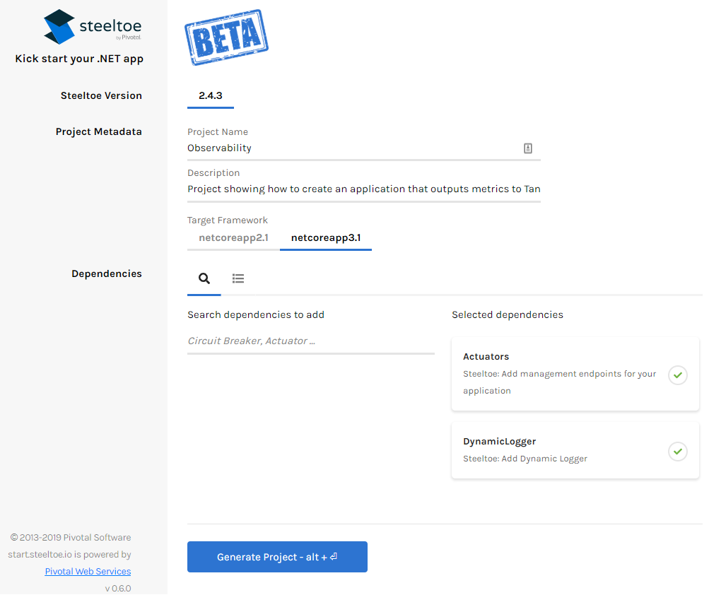
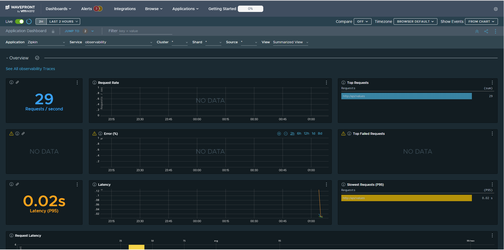

# Steeltoe Applications on Tanzu Application Service with Tanzu Observability

This repository outlines the steps in enabling [Steeltoe](https://steeltoe.io/) .NET Core Applications running on [Tanzu Application Service (TAS)](https://tanzu.vmware.com/application-service) to output metrics and traces to [Tanzu Observability (TO)](https://tanzu.vmware.com/observability).  With this solution, there is a one time configuration of [Telegraf](https://www.influxdata.com/time-series-platform/telegraf/) and the wavefront proxy.  After this initial configuration, application owners can then export traces and application metrics to TO with minimal (if any at all) application configuration changes.

- [Steeltoe Applications on Tanzu Application Service with Tanzu Observability](#steeltoe-applications-on-tanzu-application-service-with-tanzu-observability)
  - [Prerequisites](#prerequisites)
  - [Wavefront Proxy Deployment](#wavefront-proxy-deployment)
  - [Steeltoe Application](#steeltoe-application)
  - [Telegraf Deployment](#telegraf-deployment)
  - [C2C Network Policy](#c2c-network-policy)
  - [Wavefront Endpoint](#wavefront-endpoint)
  - [Future Items for Exploration](#future-items-for-exploration)

## Prerequisites

1. TAS platform that has [Docker cf push enabled](https://docs.pivotal.io/platform/application-service/2-9/devguide/deploy-apps/push-docker.html).
2. This solution utilizes a TAS platform with [Container-to-container networking](https://docs.pivotal.io/platform/application-service/2-9/devguide/deploy-apps/cf-networking.html) enabled.  While this configuration is preferred it is not explicitly required.  

   *Note: In this solution all of the applications are deployed to the internal domain of apps.internal.  If your internal domain is different please adjust the routes accordingly*

3. A Linux VM with the [CF CLI](https://docs.cloudfoundry.org/cf-cli/install-go-cli.html#-linux-installation) installed.  The prerequisite relates to the configuration choice to use C2C networking.  See the [Telegraf Deployment](#telegraf-deployment) section for more details.

## Wavefront Proxy Deployment

1. Navigate to the src/Wavefront-Proxy folder and inspect the manifest.yml file.

2. Update the following environment variables in the manifest.yml file according to your Tanzu Observability deployment.
   1. WAVEFRONT_URL = https://***{YOUR_WAVEFRONT_INSTANCE}***.wavefront.com/api/
   2. WAVEFRONT_TOKEN = ***YOUR_TOKEN***
3. Push your Wavefront proxy:

   ```powershell
   cf push
   ```

4. Configure the Wavefront Proxy to listen on multiple ports:
   1. Retrieve the application guid:

      ```powershell
      cf app wavefront-proxy --guid
      ```

   2. Use the app guid retrieved in the prior step to configure the ports for the Wavefront proxy.

      ```powershell
      cf curl /v2/apps/{***YOUR_APP_GUID***} -X PUT -d '{\"ports\": [2878, 9811]}'
      ```

## Steeltoe Application

In order to build the application we will utilize the Steeltoe Initializer to bootstrap our application.

1. Navigate to [start.steeltoe.io](https://start.steeltoe.io) and configure the application as follows:

   1. Steeltoe Version: Latest Stable (currently 2.4.3)
   2. Project Metadata:
      1. Name: Observability
      2. Target Framework: Latest [LTS](https://dotnet.microsoft.com/download/dotnet-core) release (currently netcoreapp3.1)
   3. Dependencies: Actuators, DynamicLogging
   4. Click Generate Project to download a zip file containing the new project



2. Unzip the generated projected and open the solution folder in your IDE of choice.

3. From Powershell navigate to your application directory and run the following command to add Tracing Support to your application.

   ```powershell
   dotnet add package Steeltoe.Management.TracingCore
   ```

4. Navigate to the Startup.cs file and edit it as follows:

   1. Add the following using statements to your file:

      ```cs
      using Steeltoe.Management.Endpoint.Metrics;
      using Steeltoe.Management.Tracing;
      using Steeltoe.Management.Exporter.Tracing;
      ```

   2. In the ConfigureServices method add the following services after this statement `services.AddCloudFoundryActuators(Configuration)`:

      ```cs
      services.AddPrometheusActuator(Configuration);
      services.AddMetricsActuator(Configuration);
      services.AddDistributedTracing(Configuration);
      services.AddZipkinExporter(Configuration);
      ```

   3. In the Configure method add the following after this statement  `app.UseCloudFoundryActuators();`:

      ```cs
      app.UsePrometheusActuator();
      app.UseMetricsActuator();
      app.UseTracingExporter();
      ```

   4. Copy or overwrite the local appsettings.json file with the [src/Observability/appsettings.json](src/Observability/appsettings.json) file.  Take note of the following application configuration sections found in the appsettings.json file:
      1. The Spring application name

         ```javascript
         "spring": {
            "application": {
               "name": "Observability"
            }
         }
         ```

      2. The tracing configuration, that points directly too the Wavefront proxy.

         ```javascript
         "tracing": {
            "alwaysSample": true,
            "useShortTraceIds ": true,
            "exporter": {
               "zipkin": {
                  "endpoint": "http://wavefront-proxy.apps.internal:9411/api/v2/spans",
                  "validateCertificates": false
               }
            }
         }
         ```

   5. Copy the [src/Observability/manifest.yml](src/Observability/manifest.yml) file to the application directory.

   6. Edit the Routes collection in the manifest.yml file to match your internal (C2C) and public facing domains respectively

   7. Deploy your application with the following command:

      ```powershell
      cf push
      ```

## Telegraf Deployment

*Note: Telegraf is available for a number of platforms and is distributed several different ways.  In this solution a choice was made to run a Linux (Debian/Ubuntu) version of Telegraf to support C2C networking.  Docker images of Telegraf are available on [Docker Hub](https://hub.docker.com/_/telegraf).  A choice was made to deploy a Telegraf executable over a docker based image to avoid complications of NFS volume mounts*

1. From your Linux VM, download the latest telegraph release [(currently 1.14.3)](https://dl.influxdata.com/telegraf/releases/telegraf-1.14.3-static_linux_amd64.tar.gz).

   ```bash
   wget https://dl.influxdata.com/telegraf/releases/telegraf-1.14.3-static_linux_amd64.tar.gz
   ```

2. Unpack Telegraf, for example:

   ```bash
   tar -xzf telegraf-1.14.3-static_linux_amd64.tar.gz
   ```

3. Navigate to the [src/Telegraf](src/Telegraf/) folder and take note of the telegraf.conf file.  It has been pre-configured to output metrics to the Wavefront proxy and scrape the demo application's Prometheus endpoint:

   ```conf
   [agent]
     debug = false
     quiet = true
     omit_hostname = true

   ###################################################
   #                     OUTPUTS                     #
   ###################################################
   [[outputs.wavefront]]
     host = "wavefront-proxy.apps.internal"
     port = 2878
     prefix = "observability."

   ###################################################
   #                      INPUTS                     #
   ###################################################
   [[inputs.prometheus]]
     urls = ["http://observability.apps.internal/prometheus"]
   ```

4. Overwrite the telegraf.conf file located in the directory where you unpacked the Telegraf executable with the file found in this repo at src/Telegraf.conf.

5. Copy the [src/Telegraf/manifest.yml](src/Telegraf/manifest.yml) file to the directory where you unpacked the Telegraf executable.

6. Deploy your application with the following command:  Note that we will not start the application on deployment.  This is so we can define [C2C Network Policy].

   ```bash
      cf push --no-start
   ```

## C2C Network Policy

1. Create the following C2C Network Policy Rules:
   1. Telegraf to the Wavefront proxy on TCP port 2878:

      ```powershell
      cf add-network-policy telegraf --destination-app wavefront-proxy --protocol tcp --port 2878
      ```

   2. Telegraf to the Wavefront proxy on TCP port 9411:

      ```powershell
      cf add-network-policy telegraf --destination-app wavefront-proxy --protocol tcp --port 9411
      ```

   3. Telegraf to Observability application on TCP port 80:

      ```powershell
      cf add-network-policy telegraf --destination-app observability --protocol tcp --port 80
      ```

   4. Observability app to Wavefront proxy on TCP port 9411:

      ```powershell
      cf add-network-policy observability --destination-app wavefront-proxy --protocol tcp --port 9411
      ```

   5. Now that the C2C rules are configured, start the Telegraf application

      ```powershell
      cf start telegraf
      ```

## Wavefront Endpoint

   1. You are now ready to visit your Tanzu Observability instance and observe application metrics and traces.
      1. Navigate to https://{YOUR_WAVEFRONT_ENDPOINT}.wavefront.com/
      2. From the Menu Select Applications > Application Status
      3. You should see a Zipkin Application in the list.  Click into the Application and you should see an application with your Spring application name (Observability).
      4. Drill in to observe your application metrics and traces.



## Future Items for Exploration

1. Integration with a Wavefront Proxy service that is provisioned through the Wavefront Service Broker.
2. Running Telegraf off platform
3. Removing Telegraf as a Dependency